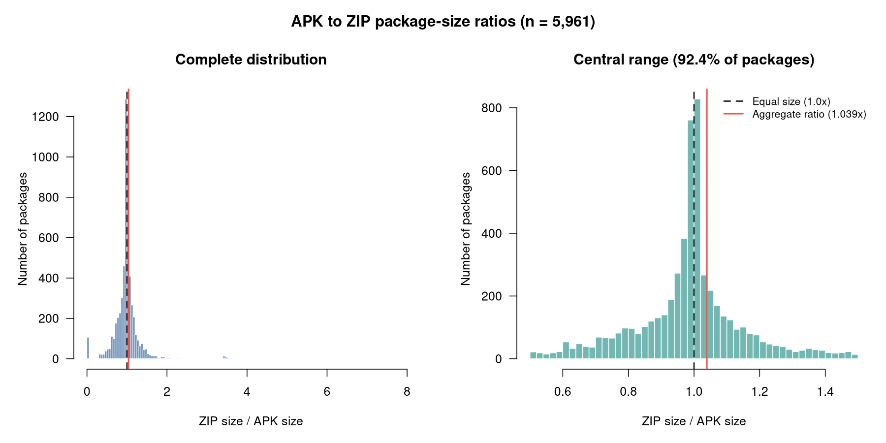

## Alpine Packages as `.zip`s

**Check it out at:** https://zpk-alpine-mirror-production.up.railway.app/v3.24/main/x86_64/

### Why?

[Alpine Linux](https://en.wikipedia.org/wiki/Alpine_Linux) is a lightweight Linux distribution using the musl libc. 
It uses the `.apk` package format, which is essentially the concatentation of three tar files into a single file, containing the signature, metadata, and file archive respectively. (Note this is not the same as the identically named Android `.apk`.) You can extract it with `apk extract`, allowing you to view the contents.

Essentially all Linux package managers use file formats based on `.tar.gz`s, (or `.tar.zst`) mostly for traditional reasons. One popular reason given is that compressing a `.tar` gives better ratio since `.zip` compresses each file individually, but `.tar.gz` compresses the entire archive, giving the algorithm the ability to deduplicate across multiple similar files in the same archive.

However, it comes with a cost. Because the whole file is compressed, we can't get random access to the file. Thus, we need to maintain seperate package metadata. Every Linux package manager comes up with their own scheme to handle this. `.apk` does it with the concatenated `.tar.gz` streams.

I wanted to explore using `.zip` as the backing format instead, since it gives you random access file entry access. Each file entry is individually compressed. As an additional bonus, `.zip` is very well supported everywhere, and plays well with tooling from other ecosystems.

At least on the Alpine main repository packages, it seems like the difference in filesizes is basically negligible (a ~3% difference over the entire repo size).

The [`zpk`](https://github.com/pimpale/zpk) package manager basically is a version of `apk` but based on `.zip`s instead (with the associated tradeoffs). It uses this repository as it's remote repository.